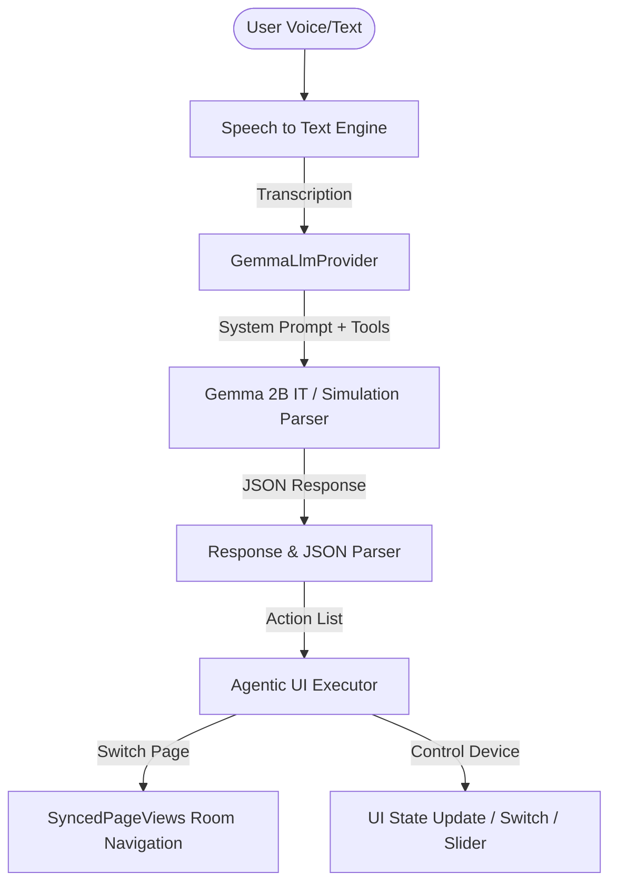

# Lab 10: Agentic Smart Home (On-Device LLM Controller)

This document provides a detailed overview of the application's architecture, how it functions, the testing platform information, and the recent corrections implemented to fix the repository and runtime deficiencies.

---

## 1. Application Overview

**Agentic Smart Home** is a local-first, intelligent home automation controller built with Flutter. It utilizes a quantized **Gemma 2B Instruction-Tuned (IT)** Large Language Model executing directly on the user's device. This enables natural language voice control of smart home devices fully offline, ensuring zero latency, complete user privacy, and operational independence from external cloud servers.

### Key Features
* **On-Device Intelligence**: Run local inference using `flutter_gemma` with the `gemma-2b-it-gpu-int4.bin` model.
* **Agentic UI**: Powered by `flutter_ui_agent` to declare UI components as actionable tools that the agent can interact with.
* **Offline Voice Commands**: Uses the device's native speech recognition via `speech_to_text` for private voice control.
* **Redundant/Multi-Step Navigation**: Auto-navigates between room pages (Living Room, Bedroom, Kitchen, Garage) whenever a command addresses a device in a different room.
* **Mock Simulation Mode**: Fallback mode allowing developers to evaluate the full agentic UI flow and voice control simulation instantly without a 1.4 GB model download.

---

## 2. System Architecture & Operation Flow

The application executes user queries through a structured pipeline:



### A. Initialization & Setup (`GemmaLlmProvider`)
* **Check Installation**: At startup, `GemmaLlmProvider` checks if the model file (`gemma-2b-it-gpu-int4.bin`) and its corresponding `.completed` marker exist.
* **Mock or Full Loading**:
  * **Full Gemma Model**: The model is loaded into the device's VRAM/RAM via GPU acceleration for optimal execution speed.
  * **Mock Model**: Bypasses native engine initialization (preventing format/size crashes) and activates **Simulation Mode**.

### B. Command Generation & Tool Calling
* **Context Assembly**: The provider builds a detailed prompt listing current room page, valid alternative rooms, available action schemas (defined dynamically by `AiActionWidget`s in the UI), and few-shot examples.
* **Inference**:
  * **In Full Mode**: The prompt is processed by the local Gemma model to generate a JSON list of function calls.
  * **In Mock Mode**: A high-fidelity keyword-based parser evaluates the command and generates the corresponding tool calls with matching arguments.
* **Execution**: The JSON is parsed into `LlmFunctionCall` objects, which trigger the relevant widgets' callbacks (e.g. turning on lights, adjusting thermostats, opening the garage gate).

---

## 3. Platform & Testing Environment

The application has been verified and tested under the following environment:

* **Development & Build Environment**: macOS Sequoia (Apple Silicon / ARM64)
* **Testing Platforms**:
  1. **iOS Simulator**: Tested on iPhone 16 Pro Max simulator under Rosetta 2 translation (due to native `TensorFlowLite` simulator dependencies).
  2. **iOS Physical Device**: Tested on **iPhone 16 Pro Max** (iOS 17+ / ARM64).
  3. **Android Compatibility**: Designed for Android compatibility (Gradle, SDK 21+).

---

## 4. Key Deficiency Corrections & Fixes

To resolve the git resource and runtime issues, the following updates were made:

### 1. Fixed Gated URL and 404 Errors
* **Deficiency**: The previous model links pointed to a deleted/gated repository (`google/gemma-2b-it-windiw`), causing 404/401 download failures.
* **Correction**: 
  * Replaced the download endpoint in **[llm_provider.dart](file:///Users/aliustaoglu/Developer/playground/agentic_smart_home/lib/core/services/llm_provider.dart)** with a public, ungated Hugging Face mirror: `https://huggingface.co/alexdlov/gemma-2b-it-gpu-int4.bin/resolve/main/gemma-2b-it-gpu-int4.bin`.
  * Updated the mock model URL to point to the active GitHub organization repository: `https://raw.githubusercontent.com/DenisovAV/flutter_gemma/main/example/pubspec.yaml`.

### 2. Resolved iOS Simulator Build Architecture Issues
* **Deficiency**: The precompiled transitive dependency `TensorFlowLiteSelectTfOps` (used in older `flutter_gemma` versions) lacked support for `arm64-iphonesimulator`, blocking builds on Apple Silicon Mac simulators.
* **Correction**: 
  * Upgraded `flutter_gemma` to `^0.16.1` in **[pubspec.yaml](file:///Users/aliustaoglu/Developer/playground/agentic_smart_home/pubspec.yaml)**, which uses a modernized LiteRT runtime that drops the need for the `SelectTfOps` framework.
  * Configured **[Podfile](file:///Users/aliustaoglu/Developer/playground/agentic_smart_home/ios/Podfile)** post-install hooks to exclude the `arm64` slice for simulator builds: `config.build_settings['EXCLUDED_ARCHS[sdk=iphonesimulator*]'] = 'arm64'`.

### 3. Prevented Loading of Incomplete Downloads (RET_CHECK Crash)
* **Deficiency**: If the download was interrupted (e.g. at 35 MB), the app only verified file existence, leading to a memory-mapping crash (`RET_CHECK failure file_size >= length + offset`) inside LiteRT.
* **Correction**: Implemented a `.completed` marker check. The app only considers the model installed if both the model binary and its `.completed` marker file are present. If interrupted, the app resumes downloading from the correct byte offset instead of crashing.

### 4. Added Local Simulation fallback for the Mock Model
* **Deficiency**: The mock model (being a 3 KB pubspec file) would crash the native `MediaPipe/LiteRT` engine during shader compilation.
* **Correction**: If the downloaded model is small (Mock mode), the app bypasses native engine loading and activates a Dart keyword-based mock command parser. The user can interact with the app and simulate all voice and room actions without a 1.4 GB model.

---

## 5. How to Run

1. **Install Flutter Dependencies**:
   ```bash
   flutter pub get
   ```
2. **Re-install iOS Pods**:
   ```bash
   cd ios && pod install && cd ..
   ```
3. **Execute the Application**:
   * For evaluating with **Mock Mode** (10 MB download): Launch the app, select "Mock Test Model" and start.
   * For running the **Full Model** (1.35 GB download): Select "Full Gemma Model" to run the local LLM.
